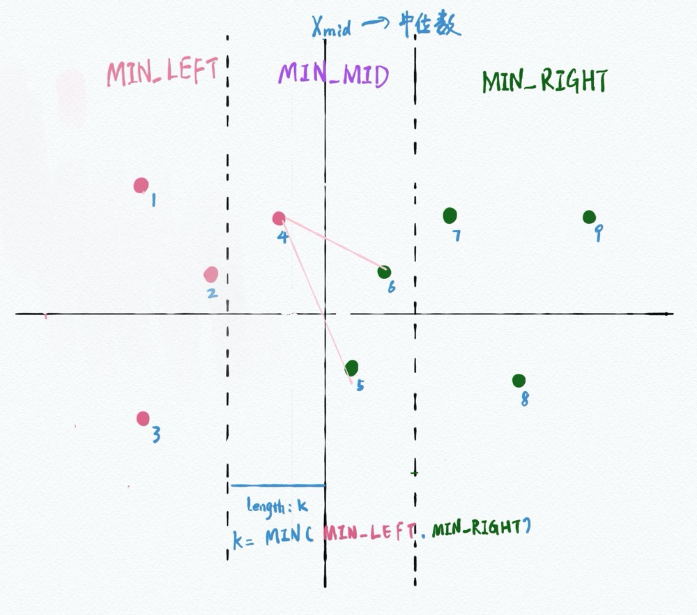

# Quoit Design

## 题目大意

[Quoit Design](http://acm.hdu.edu.cn/showproblem.php?pid=1007)

>  即从二维平面的点中，求最近距离的点对

## 解题思路

分治算法，可以找到这些点的中位数，分成左右各两块区域

那么问题就变成了 MIN = Min(左边区域的最近值, 右边区域的最近值, 左右交叉部分的最近值)



所以本题的关键在于如何将左右分界点的点算出来，因为各点之间有制约关系，将其中的点进行y轴排序，当点A与点B的Y轴相差k值时，那么其距离必定大于k。

经过证明，与点A在Y轴小于k的最多只有8个，所以中间点的距离计算是线性次的。

```
//
// Created by 周健 on 2019-12-15.
//
#include <stdio.h>
#include <math.h>
#include <algorithm>

using namespace std;

const int SIZE = 100005;
const int INF = 2147483647;

typedef struct Point {
    double x, y;
} Point;

Point pointArr[SIZE];

int cmpA(Point p1, Point p2) {
    if (p1.x > p2.x) {
        return 0;
    } else if (p1.x == p2.x) {
        if (p1.y > p2.y) {
            return 0;
        }
    }
    return 1;
}

int cmpB(Point p1, Point p2) {
    return p1.y < p2.y;
}

// 获取两个点的距离
double getDistant(Point p1, Point p2) {
    return sqrt((p1.x - p2.x) * (p1.x - p2.x) + (p1.y - p2.y) * (p1.y - p2.y));
}

double getMinDistance(int left, int right) {
    if (left >= right) {
        return INF;
    }
    // 如果是两个点，直接算出其距离
    if (left + 1 == right) {
        return getDistant(pointArr[left], pointArr[right]);
    }
    int mid = (left + right) / 2;
    // 左边最小
    double leftValue = getMinDistance(left, mid);
    // 右边最小
    double rightValue = getMinDistance(mid + 1, right);
    // 目前最小值
    double minValue = leftValue > rightValue ? rightValue : leftValue;
    // 中间范围
    Point pointArrTemp[SIZE];
    int cnt = -1;
    for (int i = left; i <= right; i++) {
        if (fabs(pointArr[i].x - pointArr[mid].x) <= minValue) {
            pointArrTemp[++cnt] = pointArr[i];
        }
    }
    sort(pointArrTemp, pointArrTemp + cnt + 1, cmpB);
    for (int i = 0; i <= cnt; i++) {
        for (int j = i + 1; j <= cnt && fabs(pointArrTemp[j].y - pointArrTemp[i].y) <= minValue; j++) {
            double dis = getDistant(pointArrTemp[i], pointArrTemp[j]);
            if (dis < minValue) {
                minValue = dis;
            }
        }
    }
    return minValue;
}

int main() {
    int round;
    while (scanf("%d", &round) && round != 0) {
        for (int i = 0; i < round; i++) {
            scanf("%lf%lf", &pointArr[i].x, &pointArr[i].y);
        }
        sort(pointArr, pointArr + round, cmpA);
        double minValue = getMinDistance(0, round - 1);
        printf("%.2f\n", minValue / 2);
    }
    return 0;
}
```